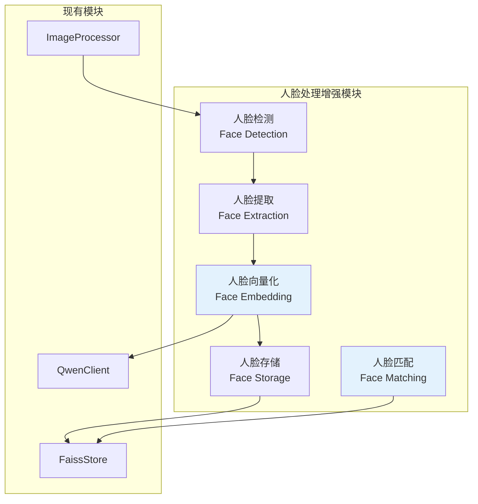
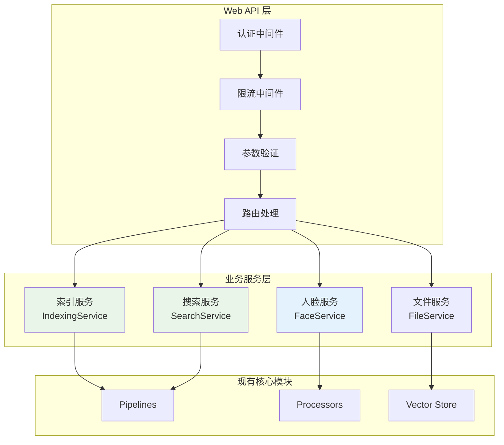

# 人脸识别和Web API接口技术方案

## 📋 方案概述

基于当前QwenRag项目的架构分析，本方案提供人脸向量精确比对和Web API接口的完整技术实施方案。

## 🔍 现状分析

### 已有人脸检测基础
- ✅ **人脸检测**: 通过Qwen VL API检测人脸区域，返回face_rects坐标
- ✅ **人脸裁剪**: crop_face_from_image函数可裁剪人脸区域
- ✅ **元数据存储**: ImageMetadata包含has_person和face_rects字段
- ✅ **基础处理流程**: IndexingPipeline已集成人脸处理逻辑

### 缺失功能
- ❌ **人脸向量化**: 缺乏专用的人脸embedding提取
- ❌ **人脸相似度比对**: 没有人脸特征匹配算法
- ❌ **Web API服务**: 仅有CLI工具，缺乏HTTP接口
- ❌ **人脸索引管理**: 缺乏专门的人脸向量存储

## 🎯 方案一：人脸向量精确比对功能

### 1.1 技术架构设计



### 1.2 核心组件设计

#### 1.2.1 人脸处理器 (FaceProcessor)
**文件位置**: `processors/face_processor.py`

```python
class FaceProcessor:
    """专门的人脸处理器"""

    def __init__(self, qwen_client: QwenClient, config: FaceProcessorConfig):
        self.qwen_client = qwen_client
        self.config = config
        self.face_store = FaceFaissStore(config.face_index_config)

    async def extract_face_embeddings(
        self,
        image_path: str,
        face_rects: List[Tuple[int, int, int, int]]
    ) -> List[np.ndarray]:
        """提取人脸embedding向量"""

    async def find_similar_faces(
        self,
        query_embedding: np.ndarray,
        top_k: int = 10,
        similarity_threshold: float = 0.8
    ) -> List[FaceSearchResult]:
        """人脸相似度搜索"""

    def calculate_face_similarity(
        self,
        embedding1: np.ndarray,
        embedding2: np.ndarray
    ) -> float:
        """计算人脸相似度"""
```

#### 1.2.2 人脸向量存储 (FaceFaissStore)
**文件位置**: `vector_store/face_faiss_store.py`

```python
class FaceFaissStore(FaissStore):
    """专门的人脸向量存储"""

    def __init__(self, config: FaceIndexConfig):
        super().__init__(config)
        self.face_metadata: Dict[int, FaceMetadata] = {}

    def add_face_embedding(
        self,
        embedding: np.ndarray,
        face_metadata: FaceMetadata
    ) -> int:
        """添加人脸embedding"""

    def search_similar_faces(
        self,
        query_embedding: np.ndarray,
        k: int = 10
    ) -> List[Tuple[int, float, FaceMetadata]]:
        """搜索相似人脸"""
```

#### 1.2.3 人脸数据模型
**文件位置**: `schemas/face_models.py`

```python
@dataclass
class FaceMetadata:
    """人脸元数据"""
    face_id: str                    # 人脸唯一ID
    image_id: str                   # 所属图片ID
    image_path: str                 # 图片路径
    face_rect: Tuple[int, int, int, int]  # 人脸框坐标
    face_embedding: np.ndarray      # 人脸向量
    confidence_score: float         # 检测置信度
    created_at: datetime           # 创建时间

@dataclass
class FaceSearchResult:
    """人脸搜索结果"""
    face_metadata: FaceMetadata
    similarity_score: float
    rank: int
```

### 1.3 实施技术方案

#### 方案A: 基于Qwen多模态模型 (推荐)
- **优势**: 统一技术栈，无需额外模型依赖
- **实现**: 使用Qwen Vision模型提取人脸特征向量
- **embedding维度**: 1536维 (与现有文本embedding保持一致)

```python
async def extract_face_embedding_qwen(self, face_image_base64: str) -> np.ndarray:
    """使用Qwen模型提取人脸embedding"""
    prompt = "请分析这张人脸图片的特征，生成用于人脸识别的向量表示"
    embedding = await self.qwen_client.get_image_embedding(
        image_base64=face_image_base64,
        instruction=prompt
    )
    return embedding
```

#### 方案B: 集成专业人脸识别模型
- **模型选择**: FaceNet, ArcFace, 或者 Insight Face
- **优势**: 专业人脸识别精度更高
- **劣势**: 需要额外的模型部署和维护

### 1.4 集成到现有流程

#### 1.4.1 索引构建流程增强
```python
# 在 IndexingPipeline 中增强
async def process_image_with_faces(self, image_path: str, metadata: ImageMetadata):
    if metadata.has_person and metadata.face_rects:
        # 提取人脸embeddings
        face_embeddings = await self.face_processor.extract_face_embeddings(
            image_path, metadata.face_rects
        )

        # 存储人脸向量
        for i, (face_rect, embedding) in enumerate(zip(metadata.face_rects, face_embeddings)):
            face_metadata = FaceMetadata(
                face_id=f"{metadata.unique_id}_face_{i}",
                image_id=metadata.unique_id,
                image_path=image_path,
                face_rect=face_rect,
                face_embedding=embedding
            )
            self.face_processor.face_store.add_face_embedding(embedding, face_metadata)
```

#### 1.4.2 检索流程增强
```python
# 在 RetrievalPipeline 中增强
async def search_by_face(self, query_image_path: str) -> List[FaceSearchResult]:
    # 检测查询图片中的人脸
    query_metadata = await self.image_processor.analyze_image(query_image_path)

    if query_metadata.has_person and query_metadata.face_rects:
        # 提取查询人脸的embedding
        query_embeddings = await self.face_processor.extract_face_embeddings(
            query_image_path, query_metadata.face_rects
        )

        # 搜索相似人脸
        all_results = []
        for embedding in query_embeddings:
            results = await self.face_processor.find_similar_faces(embedding)
            all_results.extend(results)

        return sorted(all_results, key=lambda x: x.similarity_score, reverse=True)
```

## 🌐 方案二：Web API接口架构

### 2.1 技术栈选择

#### 核心框架: FastAPI
- **优势**: 高性能、自动API文档、类型提示支持
- **异步支持**: 完美适配现有异步处理流程
- **依赖注入**: 便于集成现有服务组件

#### 部署方案:
- **开发环境**: Uvicorn
- **生产环境**: Gunicorn + Uvicorn workers
- **容器化**: Docker支持

### 2.2 API架构设计



### 2.3 API接口设计

#### 2.3.1 项目结构
```
api/
├── __init__.py
├── main.py              # FastAPI应用入口
├── dependencies.py      # 依赖注入
├── middleware.py        # 中间件
├── routers/            # 路由模块
│   ├── __init__.py
│   ├── indexing.py     # 索引管理API
│   ├── search.py       # 搜索API
│   ├── faces.py        # 人脸识别API
│   └── files.py        # 文件管理API
├── services/           # 业务服务
│   ├── __init__.py
│   ├── indexing_service.py
│   ├── search_service.py
│   ├── face_service.py
│   └── file_service.py
├── models/             # API数据模型
│   ├── __init__.py
│   ├── requests.py     # 请求模型
│   └── responses.py    # 响应模型
└── config.py           # API配置
```

#### 2.3.2 核心API端点

##### 索引管理API
```python
# POST /api/v1/index/build
@router.post("/build", response_model=IndexBuildResponse)
async def build_index(
    request: IndexBuildRequest,
    indexing_service: IndexingService = Depends()
):
    """构建图片索引"""

# GET /api/v1/index/status
@router.get("/status", response_model=IndexStatusResponse)
async def get_index_status():
    """获取索引状态"""

# POST /api/v1/index/add
@router.post("/add", response_model=AddImagesResponse)
async def add_images(
    request: AddImagesRequest,
    indexing_service: IndexingService = Depends()
):
    """添加新图片到索引"""
```

##### 搜索API
```python
# POST /api/v1/search/text
@router.post("/text", response_model=TextSearchResponse)
async def search_by_text(
    request: TextSearchRequest,
    search_service: SearchService = Depends()
):
    """文本搜索图片"""

# POST /api/v1/search/image
@router.post("/image", response_model=ImageSearchResponse)
async def search_by_image(
    file: UploadFile,
    search_params: ImageSearchParams = Depends(),
    search_service: SearchService = Depends()
):
    """以图搜图"""

# POST /api/v1/search/face
@router.post("/face", response_model=FaceSearchResponse)
async def search_by_face(
    file: UploadFile,
    face_service: FaceService = Depends()
):
    """人脸搜索"""
```

##### 人脸识别API
```python
# POST /api/v1/faces/detect
@router.post("/detect", response_model=FaceDetectionResponse)
async def detect_faces(
    file: UploadFile,
    face_service: FaceService = Depends()
):
    """检测图片中的人脸"""

# POST /api/v1/faces/compare
@router.post("/compare", response_model=FaceComparisonResponse)
async def compare_faces(
    request: FaceComparisonRequest,
    face_service: FaceService = Depends()
):
    """比较两张人脸的相似度"""

# GET /api/v1/faces/similar/{face_id}
@router.get("/similar/{face_id}", response_model=SimilarFacesResponse)
async def find_similar_faces(
    face_id: str,
    limit: int = 10,
    face_service: FaceService = Depends()
):
    """找到相似的人脸"""
```

#### 2.3.3 数据模型定义

```python
# models/requests.py
class TextSearchRequest(BaseModel):
    query: str = Field(..., description="搜索查询文本")
    limit: int = Field(10, ge=1, le=100, description="返回结果数量")
    filters: Optional[Dict[str, Any]] = Field(None, description="搜索过滤条件")

class ImageSearchParams(BaseModel):
    limit: int = Field(10, ge=1, le=100)
    similarity_threshold: float = Field(0.5, ge=0, le=1)
    include_metadata: bool = Field(True)

class FaceComparisonRequest(BaseModel):
    face_id_1: str = Field(..., description="第一个人脸ID")
    face_id_2: str = Field(..., description="第二个人脸ID")

# models/responses.py
class SearchResultItem(BaseModel):
    image_id: str
    image_path: str
    similarity_score: float
    metadata: Dict[str, Any]

class TextSearchResponse(BaseModel):
    results: List[SearchResultItem]
    total: int
    query_time_ms: float

class FaceDetectionResponse(BaseModel):
    faces: List[DetectedFace]
    face_count: int
    processing_time_ms: float

class DetectedFace(BaseModel):
    face_id: str
    bounding_box: List[int]  # [x, y, w, h]
    confidence: float
    embedding_vector: Optional[List[float]]
```

### 2.4 服务层实现

#### 2.4.1 搜索服务
```python
class SearchService:
    """搜索业务服务"""

    def __init__(self, retrieval_pipeline: RetrievalPipeline):
        self.pipeline = retrieval_pipeline

    async def search_by_text(self, query: str, limit: int = 10) -> List[SearchResultItem]:
        """文本搜索实现"""
        results = await self.pipeline.search_by_text(query, top_k=limit)
        return [self._convert_to_api_result(r) for r in results]

    async def search_by_image(self, image_data: bytes, limit: int = 10) -> List[SearchResultItem]:
        """图像搜索实现"""
        # 保存临时图片文件
        temp_path = await self._save_temp_image(image_data)
        results = await self.pipeline.search_by_image(temp_path, top_k=limit)
        return [self._convert_to_api_result(r) for r in results]
```

#### 2.4.2 人脸服务
```python
class FaceService:
    """人脸识别业务服务"""

    def __init__(self, face_processor: FaceProcessor):
        self.face_processor = face_processor

    async def detect_faces(self, image_data: bytes) -> FaceDetectionResponse:
        """人脸检测服务"""
        temp_path = await self._save_temp_image(image_data)

        # 使用现有的图像处理器检测人脸
        metadata = await self.image_processor.analyze_image(temp_path)

        faces = []
        if metadata.has_person and metadata.face_rects:
            # 提取人脸embeddings
            embeddings = await self.face_processor.extract_face_embeddings(
                temp_path, metadata.face_rects
            )

            for i, (rect, embedding) in enumerate(zip(metadata.face_rects, embeddings)):
                faces.append(DetectedFace(
                    face_id=f"temp_{uuid.uuid4()}",
                    bounding_box=list(rect),
                    confidence=0.9,  # TODO: 从检测结果获取真实置信度
                    embedding_vector=embedding.tolist()
                ))

        return FaceDetectionResponse(
            faces=faces,
            face_count=len(faces),
            processing_time_ms=time.time() * 1000  # TODO: 计算实际处理时间
        )
```

### 2.5 部署配置

#### 2.5.1 FastAPI应用配置
```python
# api/main.py
from fastapi import FastAPI, Middleware
from fastapi.middleware.cors import CORSMiddleware
from fastapi.middleware.trustedhost import TrustedHostMiddleware

def create_app() -> FastAPI:
    app = FastAPI(
        title="QwenRag API",
        description="智能图像检索系统API",
        version="1.0.0",
        docs_url="/docs",
        redoc_url="/redoc"
    )

    # 中间件配置
    app.add_middleware(
        CORSMiddleware,
        allow_origins=["*"],  # 生产环境需要限制
        allow_credentials=True,
        allow_methods=["*"],
        allow_headers=["*"],
    )

    # 注册路由
    app.include_router(indexing_router, prefix="/api/v1/index", tags=["索引管理"])
    app.include_router(search_router, prefix="/api/v1/search", tags=["搜索"])
    app.include_router(faces_router, prefix="/api/v1/faces", tags=["人脸识别"])

    return app

app = create_app()
```

#### 2.5.2 Docker部署配置
```dockerfile
# Dockerfile
FROM python:3.9-slim

WORKDIR /app

COPY requirements.txt .
RUN pip install --no-cache-dir -r requirements.txt

COPY . .

EXPOSE 8000

CMD ["uvicorn", "api.main:app", "--host", "0.0.0.0", "--port", "8000", "--workers", "4"]
```

## 📅 实施计划和优先级

### Phase 1: 人脸向量比对功能 (2周)

#### Week 1: 基础架构
- [x] **Day 1-2**: 设计FaceProcessor和FaceFaissStore架构
- [ ] **Day 3-4**: 实现人脸embedding提取 (基于Qwen模型)
- [ ] **Day 5-7**: 开发人脸相似度匹配算法

#### Week 2: 集成和测试
- [ ] **Day 1-3**: 集成到IndexingPipeline和RetrievalPipeline
- [ ] **Day 4-5**: 编写单元测试和集成测试
- [ ] **Day 6-7**: 真实API测试和性能优化

### Phase 2: Web API接口开发 (2周)

#### Week 1: API核心开发
- [ ] **Day 1-2**: 搭建FastAPI项目结构和基础配置
- [ ] **Day 3-4**: 实现搜索相关API端点
- [ ] **Day 5-7**: 实现人脸识别API端点

#### Week 2: 完善和部署
- [ ] **Day 1-2**: 实现索引管理API
- [ ] **Day 3-4**: API测试和文档完善
- [ ] **Day 5-7**: Docker化和部署配置

### Phase 3: 功能集成和优化 (1周)

#### Week 1: 整合优化
- [ ] **Day 1-2**: 前后端功能联调
- [ ] **Day 3-4**: 性能优化和缓存机制
- [ ] **Day 5-7**: 用户体验优化和文档完善

## 🎯 成功指标

### 人脸识别功能
- **准确率**: 人脸检测准确率 > 95%
- **相似度匹配**: 同一人的人脸相似度 > 0.85
- **性能**: 单张图片人脸处理时间 < 2秒
- **索引规模**: 支持10万+人脸向量存储

### API接口功能
- **响应时间**: 搜索请求平均响应时间 < 500ms
- **吞吐量**: 支持100 QPS并发请求
- **可用性**: API服务可用性 > 99.5%
- **文档完整性**: 100%的API端点有完整文档

## 🔧 技术风险和缓解方案

### 风险1: 人脸embedding质量
**问题**: Qwen模型的人脸embedding可能不如专业人脸识别模型
**缓解方案**:
- 对比测试多种embedding方法
- 准备Plan B: 集成开源人脸识别模型

### 风险2: API性能瓶颈
**问题**: 图像处理和向量搜索可能造成API响应慢
**缓解方案**:
- 实现异步处理队列
- 添加Redis缓存层
- 优化向量检索算法

### 风险3: 存储和内存压力
**问题**: 人脸向量和图像数据占用大量存储空间
**缓解方案**:
- 实现向量压缩算法
- 图片存储分层策略
- 定期清理临时文件

## 📚 依赖和资源需求

### 新增依赖包
```txt
# 人脸识别增强
fastapi>=0.104.0
uvicorn[standard]>=0.24.0
python-multipart>=0.0.6
aiofiles>=23.2.1
pillow>=10.0.0

# 可选: 专业人脸识别
# insightface>=0.7.3
# onnxruntime>=1.16.0
```

### 硬件资源建议
- **开发环境**: 8GB内存，支持GPU加速(可选)
- **生产环境**: 16GB+内存，SSD存储，支持4核+CPU
- **存储需求**: 预估每万张图片需要5GB向量存储空间

## 🔄 后续扩展计划

1. **实时人脸识别**: WebSocket支持实时视频流人脸检测
2. **人脸聚类功能**: 自动将相似人脸进行分组聚类
3. **多人脸场景**: 支持一张图片多个人脸的精确匹配
4. **移动端适配**: 提供移动端优化的轻量化API
5. **联邦学习**: 支持分布式人脸模型训练

---

本技术方案提供了完整的人脸识别和Web API功能实施路径，基于现有架构进行渐进式扩展，确保技术风险可控，实施进度可追踪。
